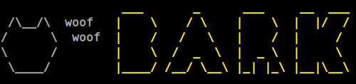

<p align="center">
  
</p>

# 🐶 bark-cpp-python 🐍

[](https://lbesson.mit-license.org/)


Python binding of [bark.cpp](https://github.com/PABannier/bark.cpp) via `ctypes`. Now you leverage the power of GGML models and their quantization version with friendly Python interface 🔥🔥🔥.

Inpsired by [llama-cpp-python](https://github.com/abetlen/llama-cpp-python), this package provides:

* [x] Low-level access to C API via `ctypes` interface
* [ ] High-level Python API for TTS

## 🚀 Demo
This demo is tested on `AMD Ryzen 5 5600H`, `Ubuntu 20.04`
```
                 ___       _      ___     __  ___
 /\__/\  woof   |    \    / \    |    \  |  |/  /
/      \  woof  |    /   /   \   |    /  |     /
\      /        |    \  /  _  \  |  _ \  |     \
 \____/         |____/ /__/ \__\ |_| |_\ |__|\__\


encodec_load_model_weights: in_channels = 1
encodec_load_model_weights: hidden_dim  = 128
encodec_load_model_weights: n_filters   = 32
encodec_load_model_weights: kernel_size = 7
encodec_load_model_weights: res_kernel  = 3
encodec_load_model_weights: n_bins      = 1024
encodec_load_model_weights: bandwidth   = 24
encodec_load_model_weights: sample_rate = 24000
encodec_load_model_weights: ftype       = 1
encodec_load_model_weights: qntvr       = 0
encodec_load_model_weights: ggml tensor size    = 320 bytes
encodec_load_model_weights: backend buffer size =  54.36 MB
encodec_load_model_weights: using CPU backend
encodec_load_model_weights: model size =    44.36 MB
encodec_load_model: n_q = 32

bark_tokenize_input: prompt: 'Hello, my name is Suno. And, uh — and I like pizza. [laughs] But I also have other interests such as playing tic tac toe.'
bark_tokenize_input: number of tokens in prompt = 513, first 8 tokens: 41226 10165 25175 21372 20172 24015 20181 10167 


bark_print_statistics:   sample time =    56.27 ms / 576 tokens
bark_print_statistics:  predict time = 13669.80 ms / 23.73 ms per token
bark_print_statistics:    total time = 13753.71 ms


bark_print_statistics:   sample time =    24.39 ms / 1728 tokens
bark_print_statistics:  predict time = 157391.81 ms / 91.08 ms per token
bark_print_statistics:    total time = 157428.17 ms


bark_print_statistics:   sample time =    60.53 ms / 6144 tokens
bark_print_statistics:  predict time = 31761.29 ms / 5.17 ms per token
bark_print_statistics:    total time = 31851.84 ms

encodec_eval: compute buffer size: 291.76 MB
```

## 🔧 Installation
Currently, due to `STATIC` is hard-coded in `add_library()` of `bark.cpp` and `encodec.cpp`, we need to modify the submodules a bit to work-around. The stable installation will be updated soon whenever my PRs for modification of `bark.cpp` and `encodec.cpp` are accepted.

1. Clone the repo and submodules
```bash
git clone --recursive https://github.com/tranminhduc4796/bark-cpp-python.git

cd bark-cpp-python
```
2. Modify the CMakeLists.txt of `bark.cpp` and `encodec.cpp` by replacing these lines in their CMakeLists.txt:
```cmake
# vendor/bark.cpp/CMakeLists.txt
add_library(${BARK_LIB} STATIC bark.cpp bark.h)
# vendor/bark.cpp/encodec.cpp/CMakeLists.txt
add_library(${ENCODEC_LIB} STATIC encodec.cpp encodec.h)
```
with
```cmake
# vendor/bark.cpp/CMakeLists.txt
option(BUILD_SHARED_LIBS OFF)
add_library(${BARK_LIB} bark.cpp bark.h)
# vendor/bark.cpp/encodec.cpp/CMakeLists.txt
option(BUILD_SHARED_LIBS OFF)
add_library(${ENCODEC_LIB} encodec.cpp encodec.h)
```
3. Build and install
```bash
mkdir build
cd build
cmake ..
sudo make install -j8
```
## High-level Python API
Update soon. While waiting, you can refer `test.py`

## Acknowledgments
* [Suno AI's bark](https://github.com/suno-ai/bark)
* [bark.cpp](https://github.com/PABannier/bark.cpp)